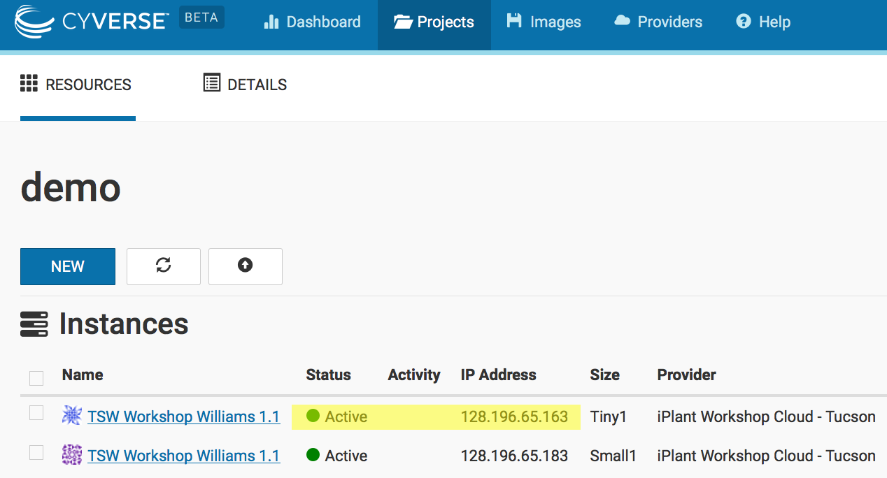

<script language="javascript" type="text/javascript">
function set_page_view_defaults() {
    document.getElementById('div_aws').style.display = 'block';
    document.getElementById('div_cyverse').style.display = 'none';
};

function change_content_by_platform(form_control){
    if (!form_control || document.getElementById(form_control).value == 'aws') {
        set_page_view_defaults();
    } else if (document.getElementById(form_control).value == 'cyverse') {
        document.getElementById('div_aws').style.display = 'none';
        document.getElementById('div_cyverse').style.display = 'block';
    } else {
        alert("Error: Missing platform value for 'change_content_by_platform()' script!");
    }
}

window.onload = set_page_view_defaults;
</script>


> ## Do I need to create my own instances?
>
> **If you are:**
>
> - teaching at or attending a centrally organized Data
Carpentry workshop,
> - a Maintainer for one of the Genomics lessons, or
> - contributing to the Genomics lessons,
>
> The Carpentries staff will create AMI instances for you. Please contact
> team@carpentries.org.
>
> **If you are:**
>
> - teaching at a self-organized workshop,
> - working through these lessons on your own outside of a workshop,
> - practicing your skills after a workshop, or
> - using these lessons for a teaching demonstration as part of your Instructor checkout for The Carpentries,
>
> you will need to create your own AMI instances using the [launching your own AMI instance instructions](https://datacarpentry.org/genomics-workshop/AMI-setup/).
>
> **If you are:**
>
> - considering what types of cloud computing resources are appropriate for you
> - interested in modifying the AMI used in this workshop,
> - want to create your own AMI from scratch, or
> - want to use these lessons on a different cloud resources,
>
> read the information and instructions below.
{: .callout}

### Choosing a cloud platform

The most important thing about *The Cloud* is choice - instead of purchasing a physical computer, you can obtain on-demand computing at almost any scale. This power comes with advantages and disadvantages:

**Advantages of Cloud Computing**
* Access large amounts of computing power on demand
* Full administrative rights - install anything
* Use pre-configured images (software already installed)

**Disadvantages of Cloud Computing**
* Cloud computing costs money (you must keep track of your costs)
* If you need help, you may not have a local system administrator
* Images may be poorly documented (you may not be clear on what is installed, or how to use it)

### Cloud platform choices

There are several cloud providers to choose from. Some scientific clouds may either be free or allocate resources competitively. Commercial clouds are can be very powerful, but choice can be overwhelming. We will cover as much as we you need to get through the Data Carpentry lessons, but you will ultimately need to learn things not covered here so see the documentation below:

#### Commercial Clouds

* [Amazon Web Services](https://docs.aws.amazon.com/AWSEC2/latest/UserGuide/EC2_GetStarted.html)
* [Google Cloud](https://cloud.google.com/compute/docs/quickstart)

#### Open Science Clouds
* [Atmosphere](https://pods.iplantcollaborative.org/wiki/display/atmman/Getting+Started)
* [JetStream](http://jetstream-cloud.org/)

**Please select the platform you wish to use for the exercises: <select id="id_platform" name="platformlist" onchange="change_content_by_platform('id_platform');return false;"><option value="aws" id="id_aws" selected> AWS </option><option value="cyverse" id="id_cyverse"> CyVerse </option></select>**

<div id="div_aws" style="display:block" markdown="1">

## AWS (Amazon EC2 instances)

- See [the detailed instructions](https://datacarpentry.org/genomics-workshop/AMI-setup/) on launching an Amazon EC2 instance for this workshop.
  - You can launch any publicly available image by changing the AMI that you load in step 4 on that page.
  - You can choose not to load an AMI at all, and install your own software later by skipping step 4 on that page.
  - If you want to launch a different set of resources- more processors, more disk space, different operating system, etc;
    you can choose a different option at step 5.
  - For more detailed instructions, and how-tos for other changes consult
    [EC2 Getting 
Started](https://docs.aws.amazon.com/AWSEC2/latest/UserGuide/EC2_GetStarted.html).

</div>

<div id="div_cyverse" style="display:block" markdown="1">

## Launching an instance on Atmosphere - These instructions are in beta and not fully tested!

> ## Prerequisites
> You must have an iPlant account (register at [https://user.cyverse.org/](https://user.cyverse.org/) ) - You must also request access to
> Atmosphere (see [documentation](https://wiki.cyverse.org/wiki/display/atmman/Atmosphere+Manual+Table+of+Contents) **CyVerse requires Atmosphere users to have a valid .edu or .org email address** )
{: .prereq}

#### Sign into Atmosphere and launch an instance
1. Sign into Atmosphere at: [http://atmo.iplantcollaborative.org/](http://atmo.iplantcollaborative.org/)
2. Select 'Launch New Instance'
   
3. Search for the 'TSW Workshop Williams 1.2' image; Select this image.
   
4. Click Launch and then select the following options in the launch wizard:
   
    - Instance Name:Enter a name(optional)
    - Base Image Version: 1.0
    - Project: Choose an existing or create a new project.
    - Provider: iPlant Cloud - Tucson
    - Instance Size: small2
5. Click Launch.

    > **Tip:** You can select a larger instance, but you must have sufficient resources (no exceeded quotas). If Atmosphere is at high capacity, you may not be able to launch an instance if the instance size exceeds what is currently free on the cloud provider

Your instance should be ready in 10-15 minutes. When your instance status is listed as 'active' you will be able to connect.

#### Connect to Atmosphere instance

**Instructions for Mac/Linux**

1. If necessary, log into your Atmosphere at: [https://atmo.iplantcollaborative.org/application/images](https://atmo.iplantcollaborative.org/application/images)
2. Click on 'Projects' and select the project that contains your instance.
3. Verifying that your instance status is **'active'**, copy the IP address (e.g. 128.123.12.34) to your clipboard.
   
3. Open the terminal application  and use 'ssh' to connect. Your command will be:

    ```bash
    $ ssh iplantusername@your.atmosphere.ipaddress
    ```
5. Your computer will be unable to verify the authenticity of the host... type **yes** to continue connecting
6. When prompted for a password, enter your iPlant username.

You should now be connected to your personal instance. You can confirm this with the following commands; ``whoami``,``pwd``, which should yield the following results:

```bash
Welcome to Ubuntu 12.04.2 LTS (GNU/Linux 3.2.0-37-virtual x86_64)

New release '14.04.2 LTS' available.
Run 'do-release-upgrade' to upgrade to it.

    _   _                             _
   / \ | |_ _ __ ___   ___  ___ _ __ | |__   ___ _ __ ___
  / _ \| __| '_ ` _ \ / _ \/ __| '_ \| '_ \ / _ \ '__/ _ \
 / ___ \ |_| | | | | | (_) \__ \ |_) | | | |  __/ | |  __/
/_/   \_\__|_| |_| |_|\___/|___/ .__/|_| |_|\___|_|  \___|
                               |_|

iPlant Collaborative

The user manual is located here: http://goo.gl/2pT72
For assistance, contact support@iplantcollaborative.org.  

Last login: Fri Aug 14 10:16:50 2015 from dhcp140-78.cshl.edu
iplantusername@vm65-164:~$ whoami
iplantusername
iplantusername@vm65-164:~$ pwd
/home/iplantusername
```
**Note**: In the above example 'iplantusername' will be your actual iPlant username.

**Instructions for PC**

1. Download the PuTTY application at: [http://the.earth.li/~sgtatham/putty/latest/x86/putty.exe](http://the.earth.li/~sgtatham/putty/latest/x86/putty.exe)
2. If necessary, log into your Atmosphere at: [http://atmo.iplantcollaborative.org/](http://atmo.iplantcollaborative.org/)
3. Click on 'Projects' and select the project that contains your instance.
4. Verifying that your instance status is **'active'**, copy the IP address (e.g. 128.123.12.34) to your clipboard.
   
5. Start PuTTY. In the section 'Specify the destination you want to connect to' for 'Host Name (or IP address)' paste in the DNS address and click 'Open'
6. When prompted to login as, enter your iPlant username; you may be notified that the authenticity of the host cannot be verified - if so, ignore the warning an continue connecting
7. When prompted for a password enter your iPlant password.

You should now be connected to your personal instance. You can confirm this with the following commands; ``whoami``,``pwd``, which should yield the following results:

```bash
Welcome to Ubuntu 12.04.2 LTS (GNU/Linux 3.2.0-37-virtual x86_64)

New release '14.04.2 LTS' available.
Run 'do-release-upgrade' to upgrade to it.

    _   _                             _
   / \ | |_ _ __ ___   ___  ___ _ __ | |__   ___ _ __ ___
  / _ \| __| '_ ` _ \ / _ \/ __| '_ \| '_ \ / _ \ '__/ _ \
 / ___ \ |_| | | | | | (_) \__ \ |_) | | | |  __/ | |  __/
/_/   \_\__|_| |_| |_|\___/|___/ .__/|_| |_|\___|_|  \___|
                               |_|

iPlant Collaborative

The user manual is located here: http://goo.gl/2pT72
For assistance, contact support@iplantcollaborative.org.  

Last login: Fri Aug 14 10:16:50 2015 from dhcp140-78.cshl.edu
iplantusername@vm65-164:~$ whoami
iplantusername
iplantusername@vm65-164:~$ pwd
/home/iplantusername
```
**Note**: In the above example 'iplantusername' will be your actual CyVerse username.


#### Bringing sample data into your Atmosphere instance

The sample dataset is **NOT** included on the Atmosphere instance. The very first time you load the instance, you will need to copy data from the public CyVerse Data Store into your instance using the following instructions.

## Setup iCommands

**Prerequisites**
* You must be connected to your Atmosphere instance

iCommands will allow you to quickly transfer data into your Atmosphere instance:

1. Initialize iCommands using the following command

    ```bash
    $ iinit
    ```
2. You will then be asked to setup your account and will need to enter the following information
   
    |Prompt|Entry|
    |------|-----|
    |irodsHost|data.iplantcollaborative.org|
    |port|1247|
    |zone|iplant|
    |irodsUserName|your iplant username|
    |Current iRODS password|your iplant password|
3. Verify that you have connected to your iPlant Data Store; view the contents of your home directory using the following the ``ils`` command:

    ```bash
    $ ils
    ```

## Copy Sample Data to your instance

1. Enter the following command:

    ```bash
    $ iget -rPVT /iplant/home/shared/iplant_training/data_carpentry_ngs/dc_sampledata_lite .
    ```
2. using ``ls`` you should be able to verify you have downloaded the dc_sampledata_lite directories and files.

> **Tip**: You can use iCommands to move data between your computer, a cloud instance, and the CyVerse Data Store. 
iCommands is installed on the Data Carpentry Amazon AMI. You can download and see documentation for iCommands [here](https://pods.iplantcollaborative.org/wiki/display/DS/Using+iCommands)

### Terminating your Atmosphere instance

When you are finished with your instance, you must terminate. Follow the following steps.

1. If necessary, sign into Atmosphere: [http://atmo.iplantcollaborative.org/](http://atmo.iplantcollaborative.org/)
2. Locate your instance (e.g. select 'Projects' and then select the project that contains the instance you will terminate.)
3. Click on the instance name to get to the 'Actions' menu. You may then select the 'Delete' button to terminate the instance.  

    > **Warning:** This will delete any data on this instance, so you must move any data you wish to save off the instance (for example by using iCommands).
5. After reading the warning and confirming you are ready, click 'Terminate' to terminate the instance.

</div>
