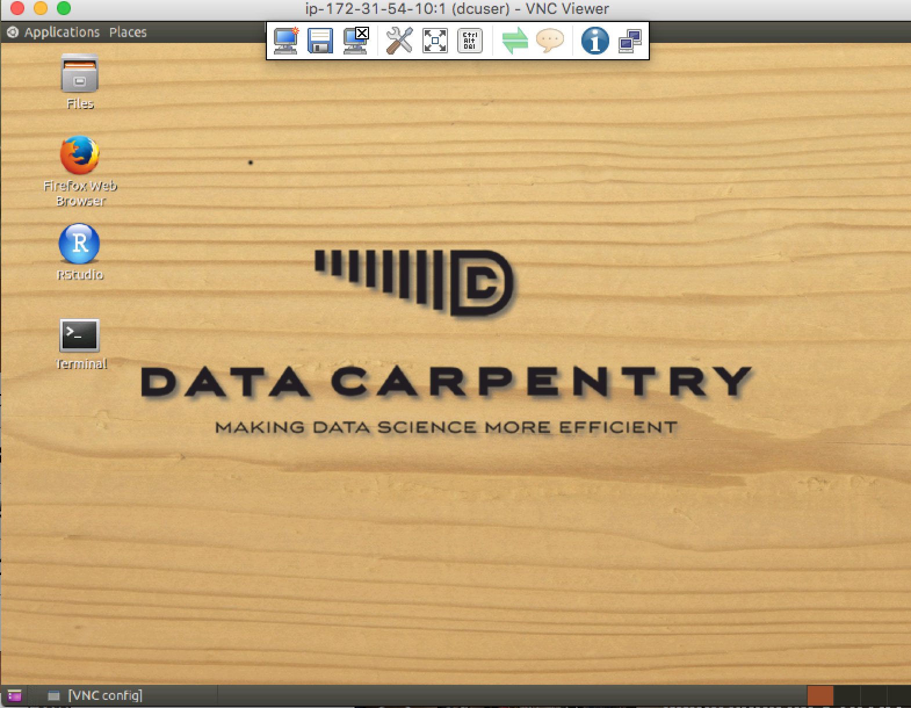

<script>
function change_content_by_platform(form_control){
    if (document.getElementById(form_control).value == "aws" or !form_control) {
        document.getElementById("div_aws").style.display = 'block';
        document.getElementById("div_cyverse").style.display = 'none';
        document.getElementById("div_pc").style.display = 'none';
    } else if (document.getElementById(form_control).value == "cyverse") {
        document.getElementById("div_aws").style.display = 'none';
        document.getElementById("div_cyverse").style.display = 'block';
        document.getElementById("div_hpc").style.display = 'none';
    } else if (document.getElementById(form_control).value == "hpc") {
        document.getElementById("div_aws").style.display = 'none';
        document.getElementById("div_cyverse").style.display = 'none';
        document.getElementById("div_hpc").style.display = 'block';
    } else {
        alert("Error: Missing platform value for 'change_content_by_platform' script!");
    }
}
//window.onload = function() {
//    document.getElementById('date').onchange = validateDate;
//};
window.onload = change_content_by_platform();
</script>
There are a number of reasons why accessing a remote machine is invaluable to any scientists working with large datasets. In the early history of computing, working on a remote machine was standard practice - computers were bulky and expensive. Today we work on laptops that are more powerful than the sum of the world's computing capacity 20 years ago, but many analyses (especially in genomics) won't work on these laptops and must be run on remote machines. 

You'll know you need to start working on the cloud when...

- Your computer does not have enough resources to run the desired analysis (memory, processors, disk space, network bandwidth).
- Your computer is taking hours or days to get through an analysis.
- You cannot install software on your computer (application does not have support for your operating system, conflicts with other existing applications, etc.)

The cloud is a part of our everyday life (e.g. using Amazon, Google, Netflix, or an ATM involves remote computing). The topic is fascinating but this lesson says '5 minutes or less' so let's get connected. 

Please select the platform you wish to use for the exercises:

<select id="id_platform" name="platformlist" onchange="change_content_by_platform('id_platform')" />
    <option value="aws" id="id_aws" selected> AWS </option>
    <option value="cyverse" id="id_cyverse"> CyVerse </option>
    <option value="hpc" id="id_hpc"> HPC/HTC cluster </option>
</select>

## Exercises

### **A. Connecting to a remote machine via SSH**

This is the first and last place in these lessons where it will matter if you are using PC, Mac, or Linux. After we connect, we will all be on the same operating system/computing environment. 

<div id="div_aws">
> To save time, your instructor will have launched an remote computer (instance) for you prior to the workshop. If you are following these lessons on your own, or after the workshop see the lesson on [launching cloud instances on your own](../discuss/) for instructions on how to do this yourself. 

**User Credentials**
Credentials are case sensitive:

- Username: dcuser
- Password: data4Carp
</div>
<div id="div_cyvers" style ="display=none">
CyVerse!!
</div>
<div id="div_hpc" style ="display=none">
HPC Cluster!!
</div>

#### **Connecting using PC**<br>
*Prerequisites*: You must have an SSH client. There are several free options and we will use PuTTY [[Download Putty.exe](http://www.chiark.greenend.org.uk/~sgtatham/putty/download.html)]
**(RMF)THIS NEEDS TO GO INTO INSTALLATION INSTRUCTIONS**

1. Open PuTTY; In the 'Host Name (or IP address)' section paste in the IP address provided by your instructor (or the ip address of an instance you have provisioned yourself). *Keep the default selection 'SSH' and Port (22)*. <br>
<p></p>
2. Click 'Open' and you will be presented with a security warning. Select 'Yes' to continue to connect. <br>
<p></p>
3. In the final step, you will be asked to provide a login and password. **Note:** When typing your password, it is common in Unix/Linux not see see any asterisks (e.g. ****) or moving cursors. Just continue typing.<br> 
<p></p>
4. You should now be connected!

---

#### **Connecting using Mac/Linux**<br>
*Prerequisites*: Mac and Linux operating systems will already have terminals installed. Simply search for 'Terminal' and/or look for the terminal icon.<br> 


1. Open the terminal and type the following command substituting 'ip_address' for the ip address your instructor will provide (or the ip address of an instance you have provisioned yourself). *Be sure to pay attention to capitalization and spaces*

        $ ssh dcuser@ip_address
        
2. You will receive a security message that looks something like the message below. Type 'yes' to proceed.

        The authenticity of host 'ec2-52-91-14-206.compute-1.amazonaws.com (52.91.14.206)' can't be established.
        ECDSA key fingerprint is SHA256:S2mMV8mCThjJHm0sUmK2iOE5DBqs8HiJr6pL3x/XxkI.
        Are you sure you want to continue connecting (yes/no)?

3. In the final step, you will be asked to provide a login and password. **Note:** When typing your password, it is common in Unix/Linux not see see any asterisks (e.g. ****) or moving cursors. Just continue typing.
4. You should now be connected!


### **B. Connecting to a remote machine via VNC** 
[VNC](https://en.wikipedia.org/wiki/Virtual_Network_Computing) - Virtual Network Computing is a technology that allows you to connect to and share the desktop of a remote computer. To use VNC the computer you are connecting to must be running a VNC server. To view the desktop, you will need to download a VNC viewing client such as RealVNCs [VNC Viewer](https://www.realvnc.com/download/viewer/).
**(RMF)INCLUDE DOWNLOAD AND INSTALL INSTRUCTIONS FOR VNC**

1. To start the VNC server on your remote computer enter the command:
```
$ vncstart
```
2. Open [VNC Viewer](https://www.realvnc.com/download/viewer/); enter the same IP address you used to connect to the remote computer via SSH **+ ':1'** (e.g. `ec2-11-11-111-11.compute-1.amazonaws.com:1`)
3. Confirm you wish to connect to the instance (you may need to say yes to confirm the first time you connect to a new instance, and/or if the connection is unencrypted). Enter your username (dcuser) and password. 
4. You should now be viewing the desktop of your instance. 
<p></p>

### **C. Verifying your connection and environment** 

When you connect, it is typical to receive a welcome screen. The Data Carpentry Amazon instances display this message upon connecting:

```bash
Welcome to Ubuntu 14.04.3 LTS (GNU/Linux 3.13.0-48-generic x86_64)

 * Documentation:  https://help.ubuntu.com/

  System information as of Sun Jan 24 21:38:35 UTC 2016

  System load:  0.0                Processes:           151
  Usage of /:   48.4% of 98.30GB   Users logged in:     0
  Memory usage: 6%                 IP address for eth0: 172.31.62.209
  Swap usage:   0%

  Graph this data and manage this system at:
    https://landscape.canonical.com/

  Get cloud support with Ubuntu Advantage Cloud Guest:
    http://www.ubuntu.com/business/services/cloud

12 packages can be updated.
10 updates are security updates.


Last login: Sun Jan 24 21:38:36 2016 from
```

You should also have a blinking cursor awaiting your command

```bash
dcuser@ip-172-31-62-209 ~ $
```

## Bonus material

Now that we have connected we can move on to the Unix shell lesson. There are however a few commands that tell you a little about the machine you have connected to:

- `whoami` - shows your username on computer you have connected to:

```bash
dcuser@ip-172-31-62-209 ~ $ whoami
dcuser
```
-  `df -h` - shows space on hard drive* 

```bash
dcuser@ip-172-31-62-209 ~ $ df -h
Filesystem      Size  Used Avail Use% Mounted on
udev            2.0G   12K  2.0G   1% /dev
tmpfs           396M  792K  395M   1% /run
/dev/xvda1       99G   48G   47G  51% /
none            4.0K     0  4.0K   0% /sys/fs/cgroup
none            5.0M     0  5.0M   0% /run/lock
none            2.0G  144K  2.0G   1% /run/shm
none            100M   36K  100M   1% /run/user
```
\* Under the column 'Mounted on' row that has '/' as the value shows the value for the main disk. 

- `cat /proc/cpuinfo` - shows detail information on how many processors (CPUs) the machine has

```bash
dcuser@ip-172-31-62-209 ~ $ cat /proc/cpuinfo
processor  : 0
vendor_id	: GenuineIntel
cpu family	: 6
model		: 62
model name	: Intel(R) Xeon(R) CPU E5-2670 v2 @ 2.50GHz
stepping	: 4
microcode	: 0x415
cpu MHz		: 2494.060
cache size	: 25600 KB
physical id	: 0
siblings	: 2
core id		: 0
cpu cores	: 2
apicid		: 0
initial apicid	: 0
fpu		: yes
fpu_exception	: yes
cpuid level	: 13
wp		: yes
flags		: fpu vme de pse tsc msr pae mce cx8 apic sep mtrr pge mca cmov pat pse36 clflush mmx fxsr sse sse2 ht syscall nx rdtscp lm constant_tsc rep_good nopl xtopology eagerfpu pni pclmulqdq ssse3 cx16 pcid sse4_1 sse4_2 x2apic popcnt tsc_deadline_timer aes xsave avx f16c rdrand hypervisor lahf_lm xsaveopt fsgsbase smep erms
bogomips	: 4988.12
clflush size	: 64
cache_alignment	: 64
address sizes	: 46 bits physical, 48 bits virtual
power management:

processor	: 1
vendor_id	: GenuineIntel
cpu family	: 6
model		: 62
model name	: Intel(R) Xeon(R) CPU E5-2670 v2 @ 2.50GHz
stepping	: 4
microcode	: 0x415
cpu MHz		: 2494.060
cache size	: 25600 KB
physical id	: 0
siblings	: 2
core id		: 1
cpu cores	: 2
apicid		: 2
initial apicid	: 2
fpu		: yes
fpu_exception	: yes
cpuid level	: 13
wp		: yes
flags		: fpu vme de pse tsc msr pae mce cx8 apic sep mtrr pge mca cmov pat pse36 clflush mmx fxsr sse sse2 ht syscall nx rdtscp lm constant_tsc rep_good nopl xtopology eagerfpu pni pclmulqdq ssse3 cx16 pcid sse4_1 sse4_2 x2apic popcnt tsc_deadline_timer aes xsave avx f16c rdrand hypervisor lahf_lm xsaveopt fsgsbase smep erms
bogomips	: 4988.12
clflush size	: 64
cache_alignment	: 64
address sizes	: 46 bits physical, 48 bits virtual
power management:
```
- `tree -L 1` - shows a tree view of the file system 1 level below your current location. 

```bash
dcuser@ip-172-31-62-209 ~ $ tree -L 1

├── dc_sample_data
├── Desktop
├── Downloads
├── FastQC
├── openrefine-2.6-beta.1
├── R
└── Trimmomatic-0.32

7 directories, 0 files
``` 

## Staying Connected to the Cloud

Depending on how you connect to the cloud, you may have processes and jobs that are running, and will need to continue running for sometime. If you have collected to your cloud desktop via VNC, jobs you start will continue to run. If you are connecting via SSH, if you end the SSH connection (e.g. you exit your SSH session, you loose your connection to the internet, you close your laptop, etc.), jobs that are still running when you disconnect. There are a few ways to keep cloud processes running in the background. Many times when we refer to a background process we are talking about what is [described at this tutorial](http://www.cyberciti.biz/faq/linux-command-line-run-in-background/) - running a command and returning to shell prompt. Here we describe a program that will allow us to run our entire shell and keep that process running even if we disconnect: `tmux`. 

### Starting and attaching to `tmux` sessions

**Starting a new session**

A 'session' can be thought of as a window for `tmux`, you might open an terminal to do one thing on the a computer and then open a new terminal to work on another task at the command line. You can start a session and give it a descriptive name:

```bash
    $ tmux new -s session_name
``` 
This creates a session with the name 'session_name'

As you work, this session will stay active until you close this session. Even if you disconnect from your machine, the jobs you start in this session will run till completion. 

**Seeing active sessions**

If you disconnect from your session, or from your ssh into a machine, you will need to reconnect to an existing `tmux` session. You can see a list of existing sessions:

```bash
$ tmux list-sessions
```

**Connecting to a session**

To connect to an existing session:

```bash
$ tmux attach -t session_name
# -t option = 'target'
```

**Switch sessions**
You can switch between sessions:

```bash
$ tmux switch -t session_name
```

**Kill a session**
You can end sessions:

```bash
$ tmux kill-session -t session_name
```

### Resources:

Cloud computing offerings:

* Amazon EC2: [http://aws.amazon.com/ec2/](http://aws.amazon.com/ec2/)
* Microsoft Azure: [https://azure.microsoft.com/en-us/](https://azure.microsoft.com/en-us/)
* Google Cloud Platform: [https://cloud.google.com/](https://cloud.google.com/)
* CyVerse (iPlant Collaborative) Atmosphere: [http://www.cyverse.org/atmosphere](http://www.cyverse.org/atmosphere)

Learn more about cloud computing in bioinformatics<br>
Fusaro VA, Patil P, Gafni E, Wall DP, Tonellato PJ (2011) **Biomedical Cloud Computing With Amazon Web Services**. PLoS Comput Biol 7(8): e1002147. doi: 10.1371/journal.pcbi.1002147 


